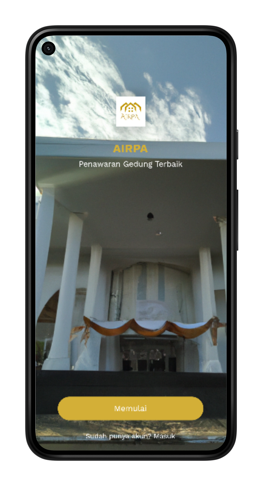
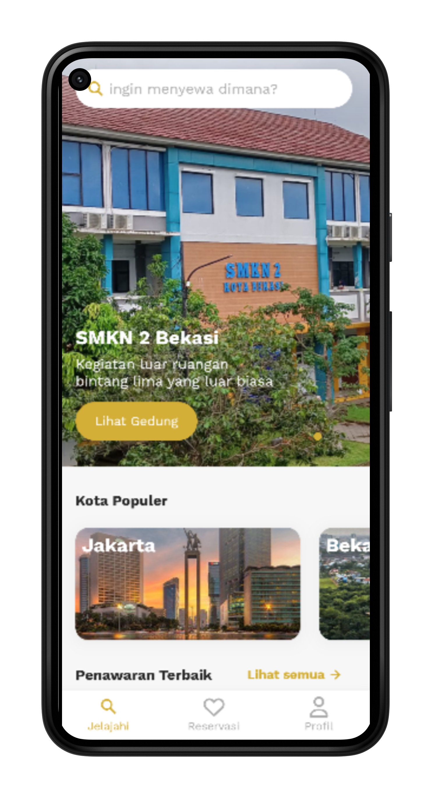
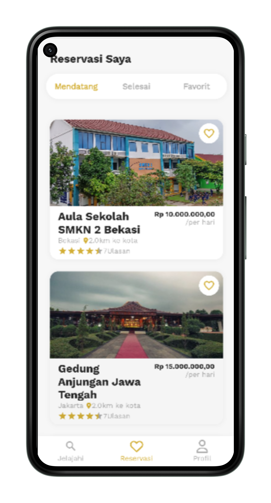
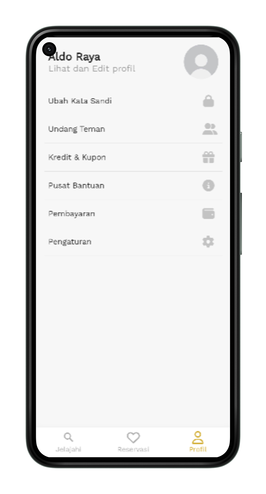
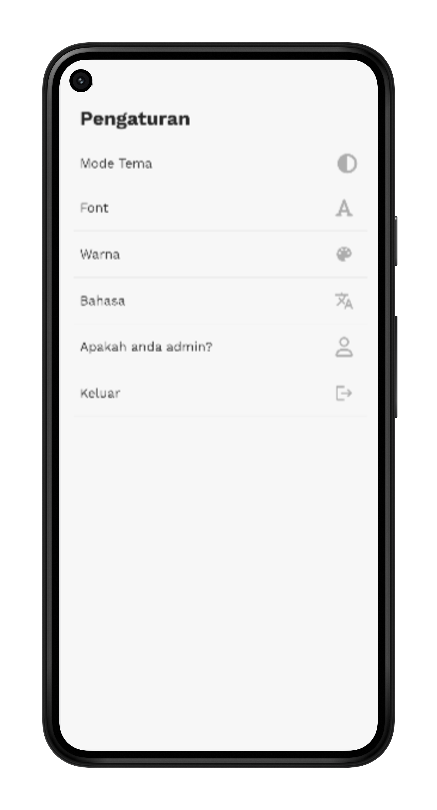

# AIRPA App

AIRPA is an android demo application for leasing buildings in the Bekasi and Jakarta areas. It provides features such as **choose a building**, **do and reserve a building**. It provides solutions for building bookers and tenants. It provides a complete list of information about the building: building name, description, location, and price.
   
**Packages we are using:**

-   smooth_page_indicator: [link](https://pub.dev/packages/smooth_page_indicator)
-   provider: [link](https://pub.dev/packages/provider)
-   font_awesome_flutter: [link](https://pub.dev/packages/font_awesome_flutter)
-   google_fonts: [link](https://pub.dev/packages/google_fonts)
-   shared_preferences: [link](https://pub.dev/packages/shared_preferences)

## Screens it contains:

=> Splash Screen

=> Introduction Screen

=> Sign Up Screen

=> Login Screen

=> explore Screen

=> Reservation Screen

=> Profile Screen

=> Settings Screen

## Photos

